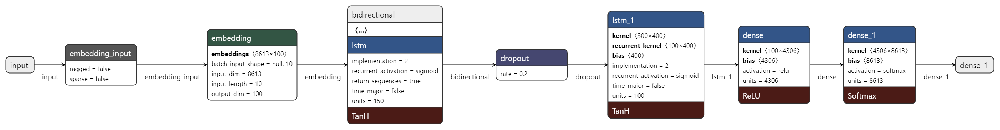

# Generating Laxmi Prasad Devkota's Poem Using Bidirectional LSTM


[](https://jupyter.org/try)<br>
[](https://forthebadge.com)

Result produced by model:

 ## "&nbsp;&nbsp;मनको व्यथा रहन्छ कहाँ मलाई बताऊ
## &nbsp; &nbsp;आमा कलेजा चिछ्र्यौ नि तर ती
## &nbsp;&nbsp;&nbsp;माया यो निशा द्यौ प्राण तिमी छ
## &nbsp;&nbsp;&nbsp;तिमी छौ पर भन्ने यो डर मलाई
## &nbsp;&nbsp;&nbsp;जुन हो वास केवल पहेँला फूल &nbsp;&nbsp; "

<br>
<br> 

## Generating Sequence of N-gram Tokens : 

Language modelling requires a sequence input data, as given a sequence (of words/tokens) the aim is the predict next word/token.

The next step is Tokenization. Tokenization is a process of extracting tokens (terms / words) from a corpus. Python’s library Keras has inbuilt model for tokenization which can be used to obtain the tokens and their index in the corpus. After this step, every text document in the dataset is converted into sequence of tokens.

Lets take a look at one of the input Sequence: 

[[1337, 2623],<br>
 [1337, 2623, 12],<br>
 [1337, 2623, 12, 39],<br>
 [1337, 2623, 12, 39, 103]]

 In the above output [1337, 2623], [1337, 2623, 12], [1337, 2623, 12, 39] and so on represents the ngram phrases generated from the input data, where every integer corresponds to the index of a particular word in the complete vocabulary of words present in the text. For example
 <br>

### Line: नछाडी जानोस् हे मेरा प्राण
### Ngrams: | Sequence of Tokens

नछाडी जानोस् हे मेरा प्राण

|  Ngram |Sequence of tokens   |   |   |   |
|---|---|---|---|---|
| नछाडी जानोस्  | [1337, 2623]  |   
|नछाडी जानोस् हे   | [1337, 2623, 12]  |   
|नछाडी जानोस् हे मेरा  | [1337, 2623, 12, 39]  |   
|नछाडी जानोस् हे मेरा प्राण |[1337, 2623, 12, 39, 103]|


## Bidirectional LSTM Model:



## Dataset: 
```You can find the original dataset ``` [📰📰HERE📰📰](https://github.com/devkotasawal1/Poem-Generator/blob/master/lspd.txt)<br>
```Download pretrained weight from ```[📦📦HERE📦📦](https://drive.google.com/file/d/1yvqhGUZWWpk3aVsgP2NKBNCwLfRFzSVA/view?usp=sharing)
